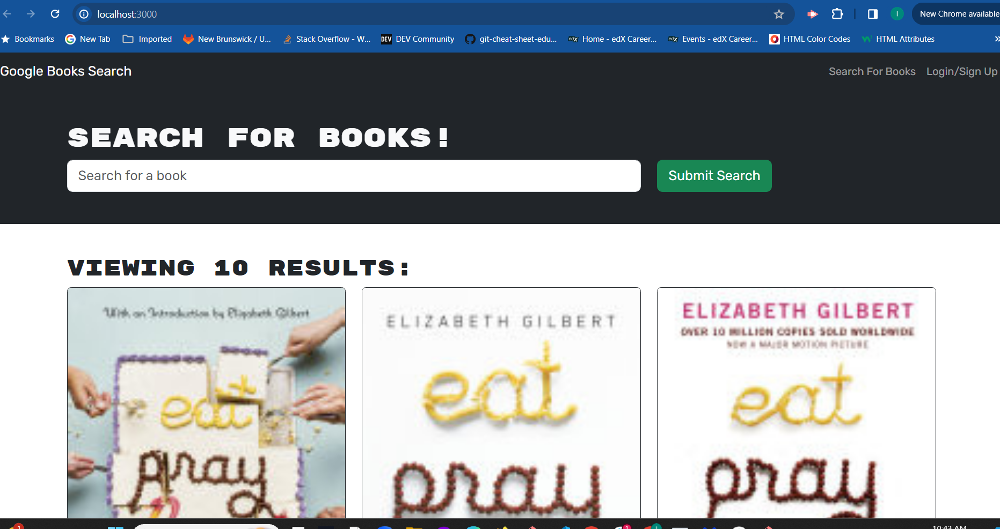
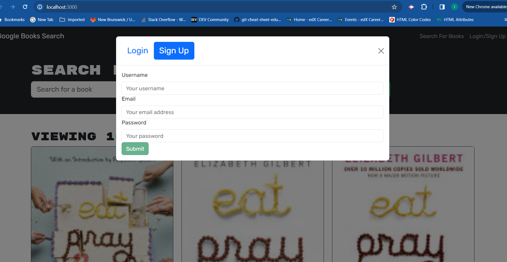

# book-search-engine
https://book-search-engine-a1x1.onrender.com/
https://github.com/imbanu1/book-search-engine

Installation
To run this portfolio locally,  npm installed on your computer. After cloning the repository, run the following commands in your terminal:
To start the app.
GIT clone from the repository.
GIT pull origin main.
CD into the server file.
NPM install.
CD back to route directory.
Then CD in to client file.
Then NPM install.
To start the front end:

NPM run dev in the client file
To start the server:

NODE Server.JS in the server file
Open http://localhost:3004 to view it in the browser.

GIVEN a book search engine
WHEN I load the search engine
THEN I am presented with a menu with the options Search for Books and Login/Signup and an input field to search for books and a submit button

WHEN I click on the Search for Books menu option
THEN I am presented with an input field to search for books and a submit button

WHEN I am not logged in and enter a search term in the input field and click the submit button
THEN I am presented with several search results, each featuring a book’s title, author, description, image, and a link to that book on the Google Books site

WHEN I click on the Login/Signup menu option
THEN a modal appears on the screen with a toggle between the option to log in or sign up

WHEN the toggle is set to Signup
THEN I am presented with three inputs for a username, an email address, and a password, and a signup button

WHEN the toggle is set to Login
THEN I am presented with two inputs for an email address and a password and login button

